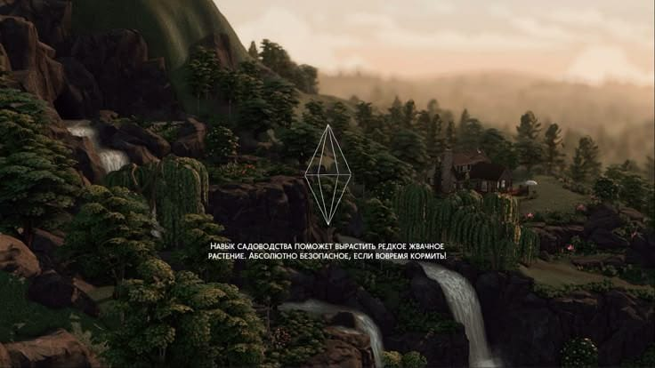

<html lang="ru">
<head>
    <meta charset="UTF-8">
    <meta name="viewport" content="width=device-width, initial-scale=1.0">
    <title>Галерея и FAQ</title>
    
</head>
<body>
    <h1>Галерея изображений</h1>
    

        
        
        
        
        
        
    

    
    
    <h2>Часто задаваемые вопросы (FAQ)</h2>
    

        
Какие системные требования у игры?

        
Минимальные требования: 8GB RAM, GTX 1050, 50GB свободного места.

    

    

        
Как установить игру?

        
Скачайте установочный файл с нашего сайта и следуйте инструкциям на экране.

    

    

        
Есть ли мультиплеер в игре?

        
Да, игра поддерживает мультиплеерный режим. Вы можете играть с друзьями онлайн.

    

     <h2>О нашей игре</h2>

Это увлекательная компьютерная игра в жанре RPG с открытым миром...

<iframe width="200" height="100" src="10 ОБЯЗАТЕЛЬНЫХ модов для СИМС 4 - смотреть онлайн в поиске Яндекса по Видео - Google Chrome 2025-03-10 21-14-52.mp4"></iframe>
<form id="contact-form">
    <label>Имя: <input type="text" id="name"></label>
    <label>Email: <input type="email" id="email"></label>
    <label>Сообщение: <textarea id="message"></textarea></label>
    <button type="submit">Отправить</button>
</form>

   

