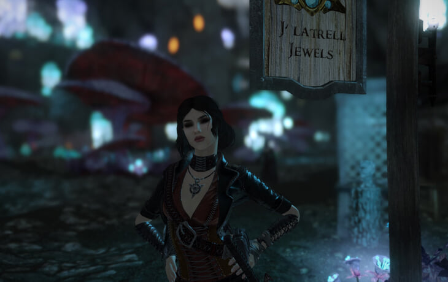

<html lang="ru">
<head>
    <meta charset="UTF-8">
    <meta name="viewport" content="width=device-width, initial-scale=1.0">
    <title>О игре</title>
    <link rel="stylesheet" href="styles.css">
    
</head>
<body>
    <h1>О нашей игре</h1>
    

        
Здесь вы можете узнать больше о нашей увлекательной игре, которая погружает вас в мир приключений и захватывающих событий!

        
        <h2>Смотрите наш трейлер</h2>
        <video width="100%" controls>
            <source src="10 ОБЯЗАТЕЛЬНЫХ модов для СИМС 4 - смотреть онлайн в поиске Яндекса по Видео - Google Chrome 2025-03-10 21-14-52.mp4" type="video/mp4">
            Ваш браузер не поддерживает видео.
        </video>
    

    <h2>Галерея</h2>
    

        
        
        
        
        
    

    

        <h2>Часто задаваемые вопросы (FAQ)</h2>
        

            <strong>Вопрос 1: Как скачать игру?</strong>
            
Ответ: Вы можете скачать игру на нашем официальном сайте в разделе "Скачать".

        

        

            <strong>Вопрос 2: Есть ли мультиплеер?</strong>
            
Ответ: Да, игра поддерживает мультиплеер для до 4-х игроков.

        

        

            <strong>Вопрос 3: Какой минимальный системный требования?</strong>
            
Ответ: Минимальные требования: 4 ГБ ОЗУ, процессор 2.0 ГГц, видеокарта с 1 ГБ видеопамяти.

        

        

    

