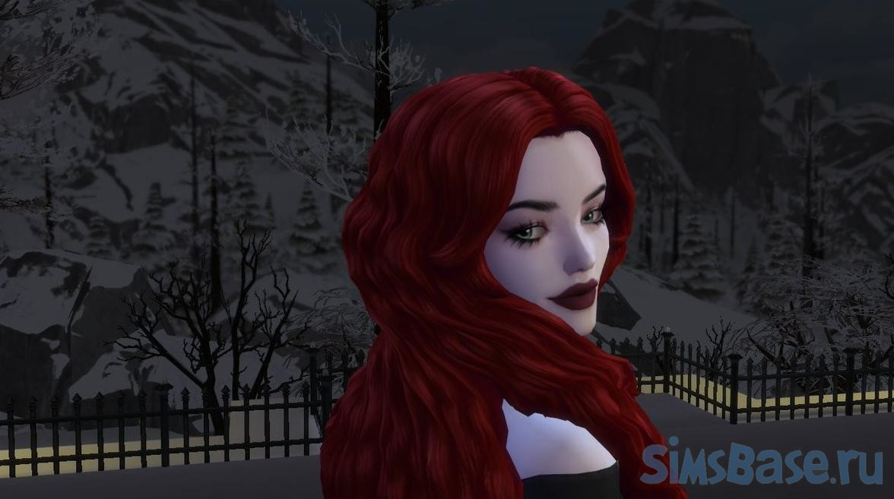
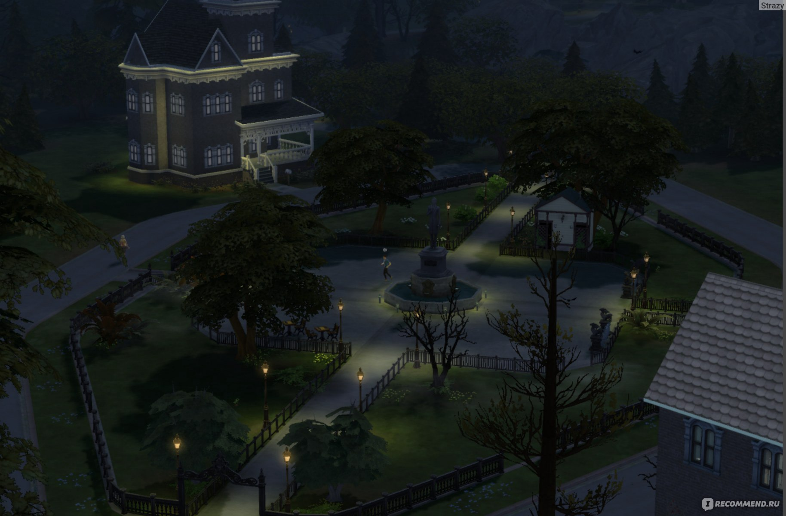

<!DOCTYPE html>
<html lang="ru">
<head>
    <meta charset="UTF-8">
    <meta name="viewport" content="width=device-width, initial-scale=1.0">
    <title>О игре</title>
    
</head>
<body>
    <h1>О игре</h1>
    

        
Описание игры и ее особенностей.

    

    <h2>Галерея</h2>
    

        
        
        
        
        
    

    
</body>
</html>
