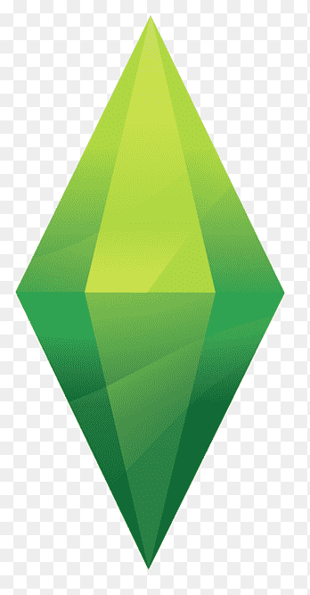

<!DOCTYPE html>
<html lang="ru">
<head>
    <meta charset="UTF-8">
    <meta name="viewport" content="width=device-width, initial-scale=1.0">
    <title>Сайт Игры</title>
    
</head>
<body>
    <header>
         <!-- Логотип -->
        <nav>
             <!-- Иконка 1 -->
             <!-- Иконка 2 -->
             <!-- Иконка для показа всех скриншотов -->
        </nav>
        <button id="theme-toggle">Сменить тему</button> <!-- Кнопка переключения темы -->
    </header>
    <main>
        <h1>Добро пожаловать в игру!</h1>
        <h2>Скриншоты игры</h2>
         <!-- Скриншот 1 -->
         <!-- Скриншот 2 -->
         <!-- Скриншот 3 -->
        <!-- Раздел новостей -->
        <section id="news">
            <h2>Новости</h2>
            

                <h3>Обновление 1.0</h3>
                
Вышло новое обновление с улучшениями графики и новыми уровнями!

                

                    <h4>Комментарии:</h4>
                    

                        
Отличная обнова! Спасибо разработчикам!

                    

                    

                        
Есть небольшие баги, но в целом хорошо.

                    

                    

                        <textarea id="commentText1" placeholder="Оставить комментарий"></textarea>
                        <button onclick="addComment(1)">Отправить</button>
                    

                

            

            

                <h3>Турнир по игре</h3>
                
Объявляем о начале турнира с ценными призами! Регистрация открыта до 20.12.2023.

                

                    <h4>Комментарии:</h4>
                    

                        
Участвую!

                    

                    

                        <textarea id="commentText2" placeholder="Оставить комментарий"></textarea>
                        <button onclick="addComment(2)">Отправить</button>
                    

                

            

        </section>
    </main>
     <!-- Модальное окно -->
    

        

            &times;
            
Добро пожаловать на сайт нашей игры!

        

    

    
</body>
</html>
