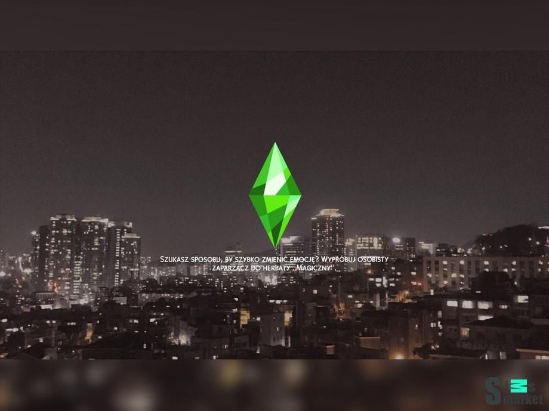
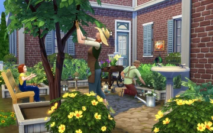

<html lang="ru">
<head>
    <meta charset="UTF-8">
    <meta name="viewport" content="width=device-width, initial-scale=1.0">
    <title>Сайт Игры</title>
    
<head>
<body>
        
   <nav>
            
            
            
   <nav>
        <button id="theme-toggle">Сменить тему</button>
    <header>
    <main>
        <h1>Добро пожаловать в игру!</h1>
        <h2>Скриншоты игры</h2>
        
        
        
        <!-- Раздел новостей -->
        <section id="news">
            <h2>Новости</h2>
            

<body>
     <meta charset="UTF-8">
    <meta name="viewport" content="width=device-width, initial-scale=1.0">
    <title>Комментарии</title>
    
    

        <h3>Обновление игры</h3>
        
Выпущено новое обновление с улучшениями и исправлениями.

        

            <h4>Комментарии:</h4>
            <h4>Комментарии:</h4>
            

                
Отличная обнова! Спасибо разработчикам!

            

            

                
Есть небольшие баги, но в целом хорошо.

            

            

                <textarea id="commentText1" placeholder="Оставить комментарий"></textarea>
                <button onclick="addComment(1)">Отправить</button>
            

        

    

    

        <h5>Турнир по игре</h5>
        
Объявляем о начале турнира с ценными призами! Регистрация открыта до 20.12.2025

        

            <h4>Комментарии:</h4>
            

                
Участвую!

            

            

                <textarea id="commentText2" placeholder="Оставить комментарий"></textarea>
                <button onclick="addComment(2)">Отправить</button>
            

        

    

    
<head>
    <meta charset="UTF-8">
    <meta name="viewport" content="width=device-width, initial-scale=1.0">
    <title>Информация</title>
</head>
<body>
    <h7>Информация</h7>
    
Это страница с дополнительной информацией. Здесь вы можете узнать больше о нашем проекте.

    
<a href="2part">глянуть</a>

</body>

