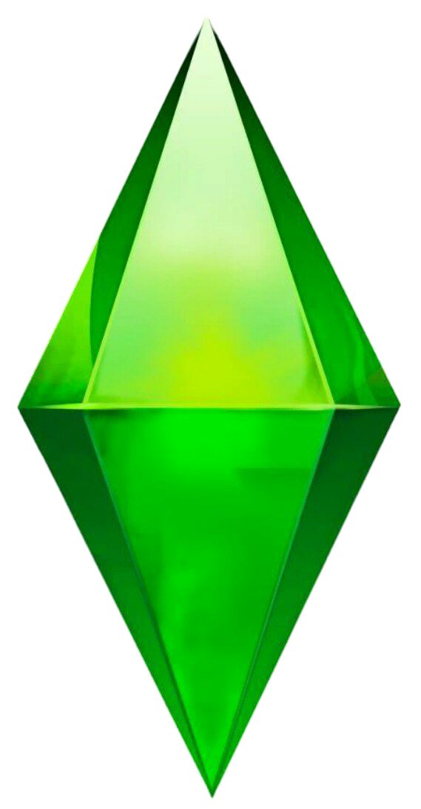

<html lang="ru">
<head>
    <meta charset="UTF-8">
    <meta name="viewport" content="width=device-width, initial-scale=1.0">
    <title>Сайт Игры</title>
    
</head>
<body>
    <header>
        
        <nav>
            
            
            
        </nav>
        <button id="theme-toggle">Сменить тему</button>
    </header>
    <main>
        <h1>Добро пожаловать в игру!</h1>
        <h2>Скриншоты игры</h2>
        
        
        
        <!-- Раздел новостей -->
        <section id="news">
            <h2>Новости</h2>
            

               <h3>Обновление игры 5.2</h3>
                
Новые персонажи и функции

                

    <h3>Комментарии:</h3>
    

        

            
Отличная обнова! Спасибо разработчикам!

        

        

            
Есть небольшие баги, но в целом хорошо.

        

        

            
Спааать хочу

        

    

    

        <textarea id="commentText1" placeholder="Оставить комментарий"></textarea>
        <button onclick="addComment(1)">Отправить</button>
    

    <h3>Турнир по игре</h3>
    
Объявляем о начале турнира с ценными призами! Регистрация открыта до конца месяца.

    

        <h3>Комментарии:</h3>
        

            

                
Не могу дождаться турнира! Участвую!

            

        

        

            <textarea id="commentText2" placeholder="Оставить комментарий"></textarea>
            <button onclick="addComment(2)">Отправить</button>
        

    

    
    <title>Информация</title> 
<body>
    <h1>Информация</h1>
    
Это страница с дополнительной информацией. Здесь вы можете узнать больше о нашем проекте.

    
<a href="2part" style="color: #7FFF00; font-size: 20px;"> ----> глянуть</a>

</body>

